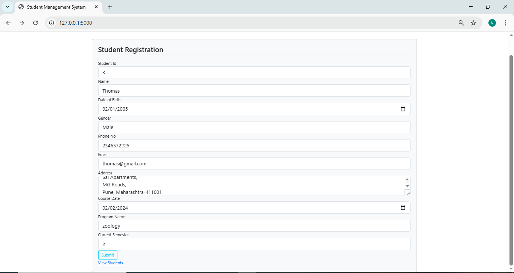
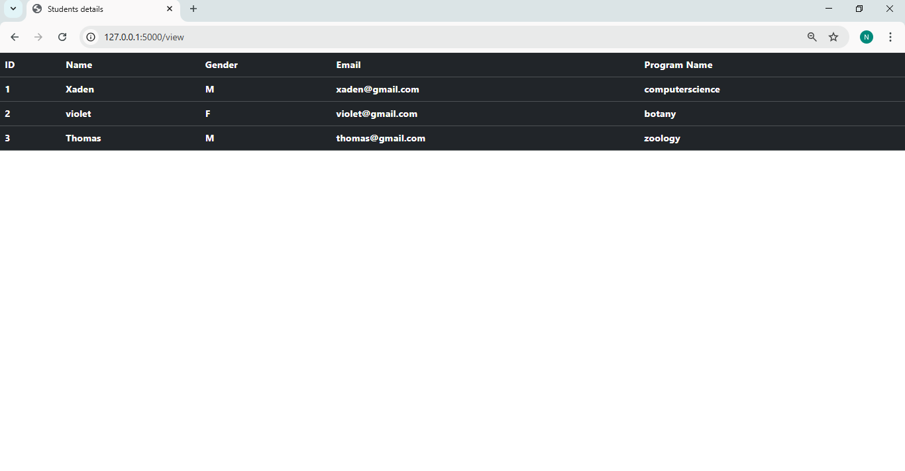

# Student Management System

A web-based Student Management System built using Flask and PostgreSQL.  
The application allows users to add student details through a form and view stored records in a web interface.

## Features
- Add student details through a web form
- Store data in PostgreSQL database
- Display student records in a table
- Form validation using Flask-WTF
- Simple UI using Bootstrap

## Technologies Used
- Python
- Flask
- SQLAlchemy
- PostgreSQL
- Flask-WTF
- Bootstrap

## Project Structure

student-management-system
│
├── student.py
├── templates
│   ├── home.html
│   └── view.html
├── static
├── screenshots
└── README.md

## Screenshots

### Student Registration Form

### Student Records

## How to Run

1. Clone the repository
git clone https://github.com/nafeesathraffa/student-management-system.git

2. Install dependencies
pip install flask flask-sqlalchemy flask-wtf psycopg2

3. Create a PostgreSQL database

4. Update the database URI in student.py

5. Run the application
python student.py
